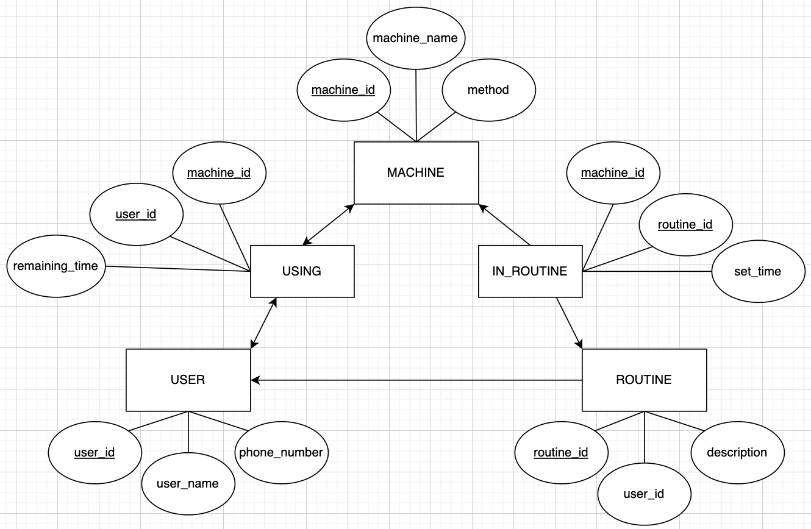

# Gym Queue

Gym Queue is a backend project that implements a gym equipment usage system using Node.js.

It follows a 3-layered architecture, utilizing MySQL as the database and Prisma ORM to implement CRUD operations.

- [Features](#Features)
- [ERD](#ERD)
- [Installation](#Installation)
- [Usage](#Usage)

## Features

- NodeJS + Express
- mySQL DB + Prisma ORM
- JOI validator
- CRUD

## ERD



## Installation

1. code setup

```sh
npm install
npx prisma generate --schema=./src/prisma/schema.prisma
npm start
```

2. change .env to your mysql DB url

## Usage

```sh
curl -X POST http://localhost:3000/signup -H "Content-Type: application/json" -d '{"email":"j@n", "password":"pw", "name":"js"}'

curl -X GET http://localhost:3000/login -H "Content-Type: application/json" -d '{"email":"j@n", "password":"pw"}'

curl -X POST http://localhost:3000/usemachine -H "Content-Type: application/json" -d '{"machineId":3, "userId":6}'

curl -X GET http://localhost:3000/listmachine

curl -X POST http://localhost:3000/addroutine -H "Content-Type: application/json" -d '{"name":"new", "description":"test", "userId":6, "machines":[1,2,3], "times":["5times","5times","5times"]}'

curl -X GET http://localhost:3000/listroutine
```
